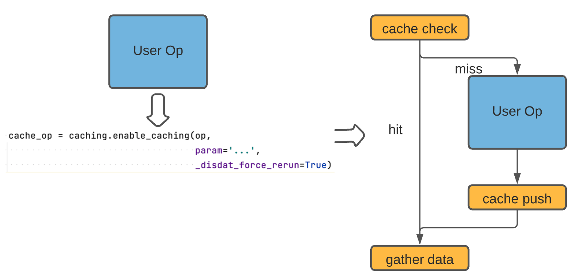

[](https://opensource.org/licenses/Apache-2.0) 
[](https://badge.fury.io/py/disdat) 
## Disdat-kfp
Disdat is a Python (3.6 +) package for data versioning and pipeline authoring that allows data scientists to create
, share, and track data products. Disdat-kfp is a plugin built upon Disdat and enables data versioning for Kubeflow Pipeline (KFP).

More specifically, this plugin does the following:
* **Caching**: Captures all intermediate outputs and reuses cached data based on task parameters.
* **Data Versioning**: All component artifacts are versioned as [bundles](https://disdat.gitbook.io/disdat-documentation/basic-concepts/bundles) on S3; it also records metadata like container image info and commands.
* **Minimum Intrusion**: Making it easy to refactor existing projects at pipeline level; users don't need to modify any KFP component definitions.
* **Share Datasets**: Intermediary artifacts can be easily shared between teams with [standardized APIs](https://disdat.gitbook.io/disdat-documentation/examples/short-test-drive/push-pull-using-s3).
## Get Started 
Install the package, the pip command will also download the core disdat package if you haven't done so already. 

`pip install disdat-kfp`

Get Started with the tutorial notebook! Check out how easy it is to version a KFP workflow in `simple_cached_workflow.ipynb`

## Documentation
### `caching_wrapper.Caching`
Used to create and configure data versioning parameters that Disdat should use. You can eithe create this object and share it between 
different components (e.g, if all data go to the same location), or you can create one object for each component  
**Args** \
`disdat_context`: `str`, the Disdat context in which the artifacts reside  

`disdat_repo_s3_url`: `str`, url of the S3 bucket. For instance `s3://my-bucket`

`force_rerun_pipeline`: `bool`, force rerun all components if set to `True` 

`use_verbose`: `bool`, see more verbose logs if set to `True` 

`caching_base_image`: `str`, the base image that Disdat-kfp uses to create caching containers. For instance `python:3.8.11-slim` 

`generated_code_dir`: 'str', where Disdat-kfp dumps generated code for each user component.


### `Caching().enable_caching`
Given a user component, wrap it up with dynamically generated containers that implements data versioning and 
smart caching. \
**Args** \
`*args`: Takes one and only one arg - the component object(`kfp.dsl.ContainerOp`) to cache 

`**kwargs`: **All** parameters for the user container are passed in as kwargs. For instance `x=10, s='123'`. You 
can also override pipeline-level configs using `_disdat_bundle=""", _disdat_force_rerun=True, _disdat_verbose=True`.

**Return**  
`kfp.dsl.ContainerOp`: the last container `gather_data`. It has exactly the same output signature as the user component.

#### Example Usage 
```
from kfp import dsl, components
from disdat_kfp.caching_wrapper import Caching

def hello(msg: str) -> str:
    print(msg)
    return 'hello world'
    
user_op = components.create_component_from_func(hello,
                                                base_image=...)
                                                
user_op_2 = components.create_component_from_func(hello,
                                                base_image=...)
                                                
caching = Caching(disdat_context=pipeline_name,
                  disdat_repo_s3_url='s3://hello-world-bucket',
                  force_rerun_pipeline=False,
                  use_verbose=True)
                  
cache_op = caching.enable_caching(user_op, 
                                msg='Hola', 
                                _disdat_bundle='hola_bundle', 
                                _disdat_force_rerun=False, 
                                _after=[])
                                
user_op_2(cache_op.outputs['Output'])
```

## Instrumentation
Since KFP is essentially an orchestrator of containers, we must make sure all containers, not just Python code, get to enjoy the benefits of data versioning. 
Hence, disdat-kfp injects containers before/after user components to pull/push data to S3 (from now on they are called caching containers).  
 

To enable data versioning and caching for a component, simply use the `enable_caching()` wrapper and pass in the component obj. 
We'll discuss the usage in the next section.

As you can see, disdat-kfp injects some containers around user's designated component. The component name and input parameters 
are used to uniquely identify an execution. Note that you should not use disdat-kfp for tasks that are not idempotent. 

To cache artifacts, the caching containers must take inputs/outputs that match user's component. However, KFP components signatures are hard-coded
in YAML, disdat-kfp cannot build a caching container that works for all components. We achieve this goal with dynamic code generation based on user's component specs.

#### `caching_check` ContainerOp
* Dynamically generated so it has the same input signature as user's component
* Given a list of input parameters as well as bundle name and context name, generate the `proc name` (a hash of parameters and bundle name)
* Check if such `proc name` exists in the remote S3 repository
* If it exists, return the latest bundle `uuid`; otherwise return `None`
* A choice op will skip the user component if `uuid` is not `None`

#### `caching_push` ContainerOp
* Dynamically generated so it has the same input signature as user's component plus  `InputPath` parameter for every user output. 
* It calculates the `proc name` and push the artifacts (passed in as files via `InputPath`) to S3

#### `gather_data` ContainerOp
* Dynamically generated so it has the same output signature as user's component 
* It takes inputs from both `caching_check` and `caching_push`. It then downloads the artifacts from S3 and 
put them into appropriate output folders on local container so that KFP scheduler know where to find them.
  
Disdat-kfp generates `caching_check, caching_push, gather_data` code at compile time. The code will be named using
the following convention `dynamic_OP_NAME_4_USER_CONTAINER_NAME`. Please note that if you have two containers with the 
same name, one will be replaced by another and your pipeline will fail! 