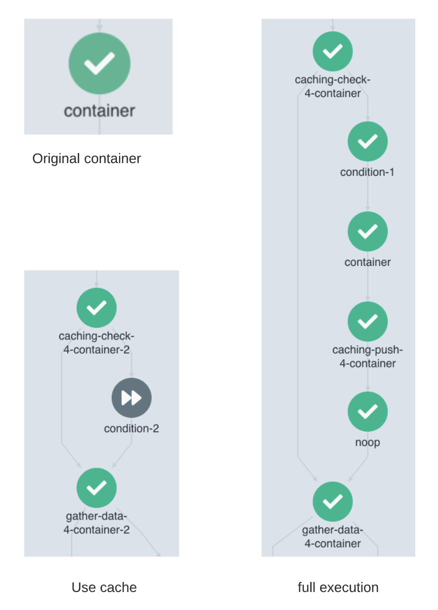

  
 

## disdat-kfp
Disdat is a Python (3.6 +) package for data versioning and pipeline authoring that allows data scientists to create
, share, and track data products. Disdat-kfp is a plugin built upon Disdat and enables data versioning for Kubeflow Pipeline (KFP).

More specifically, this plugin does the following:
* **Caching**: Captures all intermediate outputs and reuses cached data based on task parameters.
* **Data Versioning**: All component artifacts are versioned as [bundles](https://disdat.gitbook.io/disdat-documentation/basic-concepts/bundles) on S3; it also records metadata like container image info and commands.
* **Minimum Intrusion**: Making it easy to refactor existing projects at pipeline level; users don't need to modify any KFP component definitions.
* **Share Datasets**: Intermediary artifacts can be easily shared between teams with [standardized APIs](https://disdat.gitbook.io/disdat-documentation/examples/short-test-drive/push-pull-using-s3).

## Instrumentation
Since KFP is essentially an orchestrator of containers, we must make sure all containers, not just Python code, get to enjoy the benefits of data versioning. 
Hence, disdat-kfp injects containers before/after user components to pull/push data to S3.  
  
To enable data versioning and caching for a component, simply use the `enable_caching()` wrapper and pass in the component obj. 
We'll discuss the usage in the next section. 

